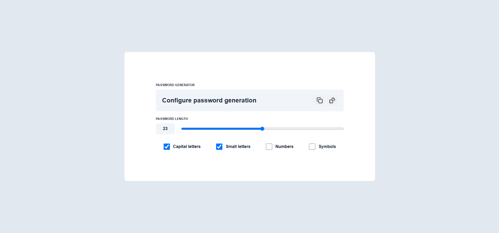

<a href="https://pass-generator-delta.vercel.app/" target="_blank" rel="noopener noreferrer"></a>

# Simple Password generator

A convenient password generator with support for security settings.

## Description

This application allows you to generate random passwords with the ability to customize:

-   use of uppercase/lowercase letters;
-   adding numbers and symbols;
-   password length.

## Project structure

```
├── dist/               # Compiled version (ignored by Git)
├── public/             # index.html, favicon, styles
├── src/                # Basic logic (TypeScript)
├── LICENSE
├── README.md
├── package.json
└── tsconfig.json
```

## Instructions for running locally

##### Clone the repository

```bash
git clone https://github.com/uncle-Yevhenii/pass-generator.git
```

##### Install dependencies

```bash
npm install
```

##### Install dependencies

```bash
npm run start
```

## License

This project is licensed under the [MIT](LICENSE) License.
You are free to use, copy, modify, and distribute it, provided you retain the copyright notice.
